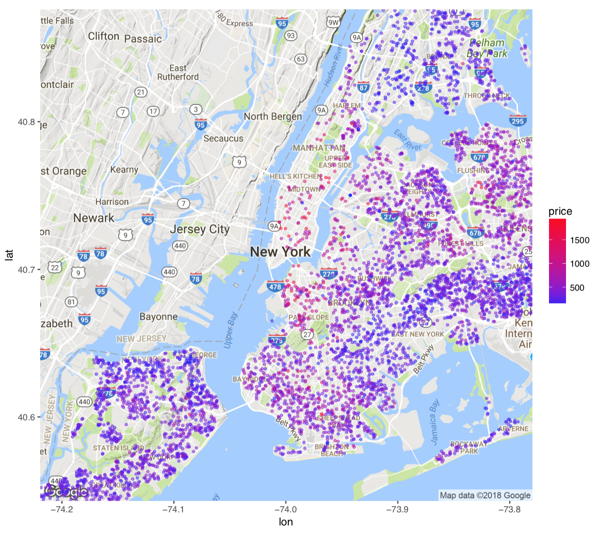
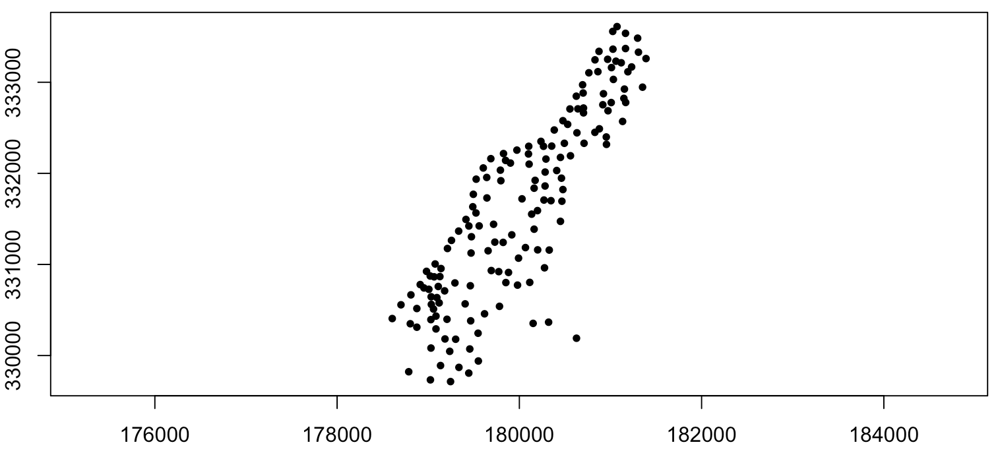
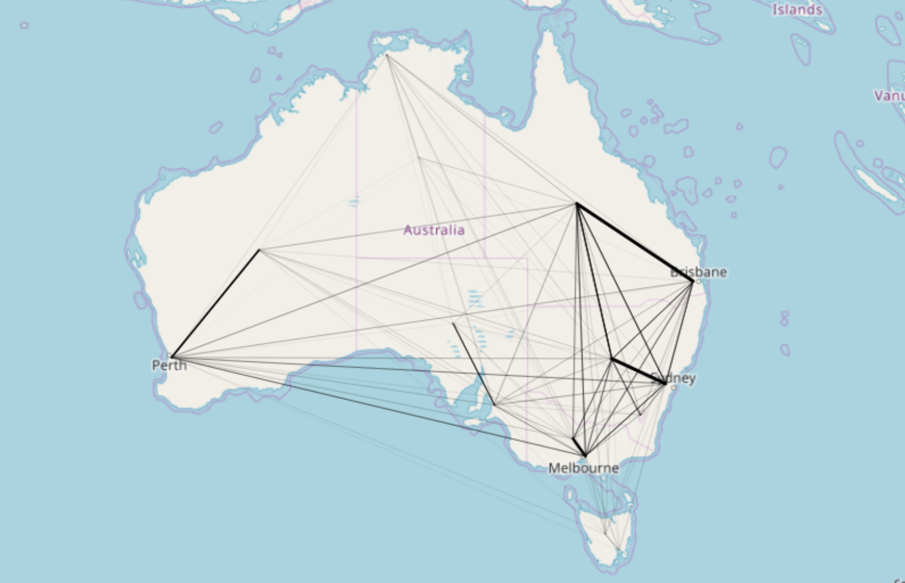
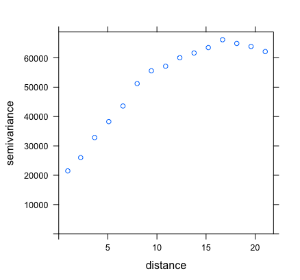
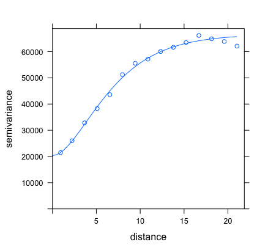
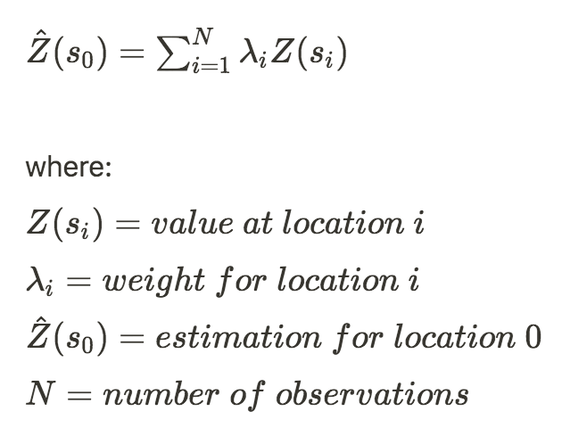

# Introduction
In this article, you will understand what is geostatistics, and how to use kriging, an interpolation method, to make estimates using geolocation data. In our example, we will take prices of real estate sales in New York and create a model that gives us a price estimate for any location within the city.
Before we start, let's look at some context of how geostatistics is inserted within the field of spatial statistics.

# Spatial statistics
Spatial statistics is a relatively new domain within statistics and it is based on the idea of spatial dependence between data: the closer two observations are in space, the stronger their correlation is. Time dependence has been studied for a long time, but it is not possible to directly apply time series models to spatial data, since time dependence hypotheses usually use a serial correlation structure, while spatial correlation happens in two or three dimensions. There are, however, spatio-temporal models that combine both at the same time.
Within spatial statistics, there are four categories of data: geostatistical, lattice, point and flow. We will only be talking about geostatistics here, but knowing what are the others helps us understand what geostatistics is not.

In geostatistical data, a random variable can be measured at any of the infinite points of our set (a city or a country, for example) - even though, in practice, it is only measured at some points. This is the case of the example we will be using: you can have real estate prices (our random variable) at any point in New York (our set), and we only measure it at some of them (the points where a sale actually occurred). Our interest will then be to estimate that same variable for points where a sale did not happen.

```{r, out.width = "50%", fig.align="center", echo = FALSE}

```

In lattice data, a random variable is measured in a finite set, represented by a matrix, that can be regular or not. An example is when we split a country in states and measure average income in each of these states.

```{r, out.width = "50%", fig.align="center", echo = FALSE}
knitr::include_graphics("Images/lattice_data.png")
```

In point data, the randomness comes not necessarily from the variable, but from its location. An example would be if we wanted to understand or predict crime locations in a city: we would have a series of crime locations and would be interested in finding clusters of high density (dangerous zones).

```{r, out.width = "50%", fig.align="center", echo = FALSE}

```
In flow data, we have a random variable attached not only to one location, but to two of them. An example is migration data: we know the number of people that go from one location to the other, for any pairwise combination of locations.

```{r, out.width = "50%", fig.align="center", echo = FALSE}

```
Now we know what is geostatistics (and what it is not). Before we look at kriging, we have one last topic to cover: variograms.

## Variogram
If spatial statistics is based on the idea that "the closer two observations are in space, the stronger their correlation is", a variogram shows how that correlation behaves depending on the distance between those observations.
A variogram is defined as "a function that, given a distance between two observations, returns the variance of the difference between those observations".
Here is an example of an empirical variogram for real estate prices in New York.

```{r, out.width = "50%", fig.align="center", echo = FALSE}

```

As we can see, the further away two buildings are, the more their prices can differ, and the less correlated they are.
Based on those points, we can estimate a function that fits them well, which we then use for kriging.

```{r, out.width = "50%", fig.align="center", echo = FALSE}

```

# Kriging
Kriging is an interpolation method: given some data points, it tries to find a function that goes through these points so one can make estimations for intermediate values.
While linear regression and inverse distance weighted interpolation are based on a hypothetical pre-defined model, kriging is basically built empirically. One of its strengths is that it is not a deterministic model, but a probabilistic one, meaning that not only it gives you an estimate, it also tells you how sure you can be of those estimates.
The equation for making those estimations is the following:

```{r, out.width = "50%", fig.align="center", echo = FALSE}

```
The weights are estimated from the variogram, and depend exclusively on the distance between the observations.

# How to do it with R
## The data
We will be using a dataset available on Kaggle, which has property sales data on New York city for the year of 2016: location, price, area, tax class, etc. Given our goal here, we will ignore all information on the property except for its location, price and area. The reason we use area is that we want to calculate price per square feet, and not just sale price. From now on, we'll only talk about price per square feet, and refer to it just as 'price'.

## The code

```{r warning=FALSE,message=FALSE}
# plots and maps
library(leaflet)
library(RColorBrewer)
library(tidyverse)
library(scales)

# spatial data
library(geoR)
library(sp)
library(sf)
library(gstat)
library(raster)
library(automap)

# other stuff
library(Metrics)
library(FNN)
library(caret)
library(readr)

# reading data
#setwd(dirname(getActiveDocumentContext()$path))
db = read.csv('db.csv')

# Removing outliers
boxplot(db$PRICE.SQUARE.FEET)
db = subset(db, PRICE.SQUARE.FEET<2000)
db = subset(db, PRICE.SQUARE.FEET>100)
boxplot(db$PRICE.SQUARE.FEET)

# Converting factor columns
factor_cols = c('BOROUGH', 'TAX.CLASS.AT.TIME.OF.SALE')
db[factor_cols] <- lapply(db[factor_cols], factor)

# Plotting prices
mapnyc <- data.frame(latitude = db$lat,
                     longitude = db$lon,
                     price = db$PRICE.SQUARE.FEET)

Token_map_box = read_file("api_token.txt")

palette_rev <- rev(brewer.pal(10, "RdYlBu"))

pal <- colorNumeric(palette = palette_rev, domain = c(max(mapnyc$price):min(mapnyc$price)))
leaflet() %>%  addTiles(urlTemplate = Token_map_box) %>%
  addCircleMarkers(data = mapnyc, color = ~pal(price), radius = 2)

```
As we can see, there were a lot less sales on Manhattan, specially on the lower part. Additionally, prices seem a lot higher there than in Queens (the part on the east) for instance. Also, we can see that property that is right next to water is more expensive too, which makes sense, since they probably have a nice view.
Now, let's see if prices follow a normal distribution:

```{r warning=FALSE,message=FALSE}
# Checking for data normality
hist(log(db$PRICE.SQUARE.FEET)) # use log
db$PRICE.SQUARE.FEET.log = log(db$PRICE.SQUARE.FEET)
hist(db$PRICE.SQUARE.FEET.log)
```
As we can see, our data is not normally distributed, so let's use its log instead. Please note that this step is not absolutely necessary: data following a normal distribution is not one of kriging's assumptions. However, slightly improved prediction power has been reported when this is the case.

For now, all we did was use a regular dataframe. Spatial data, however, behaves in a totally different way in R. We can convert our dataframe into a SpatialPointsDataFrame, which stores point data as locations, together with additional information on them (such as the price). Before doing that, we will also split our dataframe into train and test sets, in order to calculate some error metrics at the end.


```{r warning=FALSE,message=FALSE}
# Train/test split
smp_size <- floor(0.75 * nrow(db))

set.seed(123)
train_ind <- sample(seq_len(nrow(db)), size = smp_size)

train <- db[train_ind, ]
test <- db[-train_ind, ]

# Converting to spatialpointsdataframe
projection = "+proj=longlat +ellps=WGS84 +no_defs"
train_spdf = SpatialPointsDataFrame(train[28:29], train[-c(28,29)], proj4string = CRS(projection))
test_spdf = SpatialPointsDataFrame(test[28:29], test[-c(28,29)], proj4string = CRS(projection))
db_spdf = SpatialPointsDataFrame(db[28:29], db[-c(28,29)], proj4string = CRS(projection))
```

Notice the function SpatialPointsDataFrame, from the 'sp' package. It takes the location columns as its first argument, the rest of the data as the second argument, and a projection as the third argument. A projection is a function that turns spherical coordinates into planar coordinates. There are many different ways of doing this, and we used the WGS84 system.
We then remove any duplicate locations, since kriging takes only one value (price) per location.

```{r warning=FALSE,message=FALSE}
# Removing duplicate locations
train_spdf = train_spdf[-zerodist(train_spdf)[,1],]
test_spdf = test_spdf[-zerodist(test_spdf)[,1],]
db_spdf = db_spdf[-zerodist(db_spdf)[,1],]
```

Now, let's see if there seems to be any spatial correlation, by looking at the general empirical variogram. We can also, at the same time, find the best fit for the variogram, and plot both together.

```{r warning=FALSE,message=FALSE}
# Choosing the best variogram
vario.fit = autofitVariogram(PRICE.SQUARE.FEET.log~1,
                             train_spdf,
                             model = c("Exp", "Sph"),
                             kappa = c(0, 0.01, 0.05, seq(0.2, 2, 0.1), 5, 10),
                             fix.values = c(NA),
                             start_vals = c(NA),
                             verbose = T)

fit.v = vario.fit$var_model

lzn.vgm <- variogram(PRICE.SQUARE.FEET.log~1, train_spdf) # calculates sample variogram values 
lzn.fit <- fit.variogram(lzn.vgm, model=fit.v, fit.kappa = TRUE) # fit model

plot(lzn.vgm, lzn.fit) # plot the sample values, along with the fit model
```
The empirical variogram here is represented by the circles, while our fit is represented by the line. The package 'automap' has a function called 'autofitVariogram' that finds the best fit for the empirical variogram out of a combination of parameters given by the user, such as the shape of the function. The spatial correlation seems evident and our line fits the data reasonably, so we move on with it.
Now that we got our variogram function from the available data, we want to plot our estimations for new data, in order to create a heatmap of prices in NY. To do so, we need a grid of NY, which is essentially a set of small squares within the city boundaries. This is maybe a good time to talk about the different types of spatial data in R. Spatial coordinates can give you either points, lines or polygons. Our price data is given for points and NY city boundaries are given by a polygon, that can be downloaded here as a shapefile (.shp).

```{r warning=FALSE,message=FALSE}
# Getting NY polygon
ny_polygon = st_read('data/borough_boundaries/geo_export_a88ff5b0-7fb1-479d-a22b-224328f6d976.shp')
ny_polygon = st_transform(ny_polygon, projection)

spd <- sf::as_Spatial(st_geometry(ny_polygon), IDs = as.character(1:nrow(ny_polygon)))
spd_data = ny_polygon
spd_data$geometry = NULL
spd_data <- as.data.frame(spd_data)
spd <- sp::SpatialPolygonsDataFrame(spd, data = spd_data)

grid <- makegrid(spd, cellsize = 0.01)
grid <- SpatialPoints(grid, proj4string = CRS(projection))
grid <- grid[spd, ]
```

What we did here was get the NY polygon using the same projection as our original data, turn it into a SpatialPolygonsDataFrame and then use it to make a grid, where each cell is of size equal to the variable 'cellsize'. The smaller this number, the more detailed (or less "pixelated") will be your map, but the longer it will take to build it.
We then move to the kriging part itself, where we apply it to our grid:

```{r warning=FALSE,message=FALSE}
# Kriging
heat = krige(PRICE.SQUARE.FEET.log ~ 1, locations = train_spdf, newdata = grid, model = fit.v)

heat %>% as.data.frame %>%
  ggplot(aes(x=x1, y=x2)) + geom_tile(aes(fill=var1.pred)) + coord_equal() +
  scale_fill_gradient(low = "yellow", high="red") +
  scale_x_continuous(labels=comma) + scale_y_continuous(labels=comma) +
  theme_bw()
```

Here, we used the function 'krige', where we tell it what model to use ('fit.v' is where we fit our variogram function) and 'newdata' is our grid. We then plot it as a heatmap, where we can clearly see the high price areas as a red zone around Lower Manhattan, even though we didn't have much data there.
Let's then evaluate the performance of our model in the test data, by comparing it to another, simpler method: K-nearest neighbors (KNN). In short, what KNN will do is, for each building on the test set, take the price for the K nearest buildings (in our case, the best value for K was 14) and use their average to estimate a price.

```{r warning=FALSE,message=FALSE}
# measure performance on test set
kriging_test_prediction = krige(PRICE.SQUARE.FEET.log ~ 1, locations = train_spdf,
                        newdata = test_spdf, model = fit.v)

kriging_error = rmse(test_spdf$PRICE.SQUARE.FEET, exp(kriging_test_prediction$var1.pred))

# K-nearest neighbours
k_vector = seq(1, 20)
k_error_vector = c()
for (k in k_vector)
{
  knn_model = knn.reg(train[c('lon','lat')], test = NULL,
                      train$PRICE.SQUARE.FEET.log, k = k)
  k_error = rmse(train$PRICE.SQUARE.FEET, exp(knn_model$pred))
  k_error_vector = c(k_error_vector, k_error)
  
}

plot(k_vector, k_error_vector, type="l") 

# optimal k seems to be around 14
knn_model = knn.reg(train[c('lon','lat')], test = test[c('lon','lat')],
                    train$PRICE.SQUARE.FEET.log, k = 14)

knn_error = rmse(test$PRICE.SQUARE.FEET, exp(knn_model$pred))

# final results
cat(paste('Kriging error:', kriging_error, '\nKNN error:', knn_error))
```
Here, we used the Root Mean Square Error (RMSE) to compare the two models, which takes the square root of the average squared difference between predicted and actual values. As we can see, kriging error was slightly smaller, but for a very small margin. Depending on the application, it might be better to go for the KNN, since it is faster and easier to calculate. The goal here, however, was to show how kriging works and how to do it using R.

#Going further
If you want to try more advanced methods using this data, it might be interesting to check out kriging regression, which does kriging combined with regression using other explanatory variables (such as the building's year of construction, for example).
